# Nightingale

**Public transit gets you near the hospital. Nightingale gets you to the right door.**

A fresh build for **AI Builder Cup 2026** (Hack2Skill × Google Cloud). It guides one journey: transit exit → verified hospital entrance — the last 300 meters where maps say "arrived" but the person is standing between three buildings, two entrances, and a parking ramp.

## Source and handoff

This repository owns the API, verified route and evaluation evidence. The [companion frontend repository](https://github.com/Crystal32378/Nightingale) contains the Chinese UI, bird and 44 reviewed speech assets. The original `zh-tw-preview-2026-10-08` tags remain fixed. The subsequent Chinese voice preview has separate source/deployment receipts; GitHub publication does not promote production traffic.

Start the next session with [the current handoff (繁體中文)](HANDOFF.md). See [English-version preparation](docs/english-preparation.md) for the next phase and [the current paired version record](docs/deployment/2026-10-08-english-preview/state.json) for the exact deployed code commits.

## Architecture principle

> **AI interprets. Verified data decides.**

- **Route truth** is a human-authored, field-verified checkpoint graph (`fixtures/*.json`). No LLM ever writes it.
- **Gemini** (Vertex AI) maps text/photo observations to canonical evidence. A separate short-audio transcription endpoint returns only editable, unconfirmed text. The user must press Send before it enters the route flow.
- **Validator** (`src/validator.ts`) is a pure function comparing evidence against route truth. Fail-closed: landmarks not registered in the route never count as evidence.
- **Engine** (`src/engine.ts`) is a deterministic state machine: `AT_CHECKPOINT → AMBIGUOUS → RECOVERING → ARRIVED`. It owns the question budget (one clarifying question, then re-anchor), recovery pointers, and arrival — which requires specific entrance evidence, never GPS proximity.
- LLM output is untrusted structured input: schema-validated (`zod`), with deterministic fallback. A failed Gemini call can never invent a route.

## Status

[English / Chinese prototype](https://nightingale-walk-with-me--english-20261008-q4gion1y.web.app/?flow=last300m&photo=1&lang=en) — expires **2026-11-07 13:27 Asia/Taipei**. The language switch changes presentation without resetting the walk. Backend runtime `34bc9be`; frontend runtime `cdb9da5`.

The complete English flow includes voice/text/photo entry, explicit text confirmation, follow-up questions, recovery, both crossings, entrance confirmation, and the help card. Chinese sign words remain visible for real-world matching. Both languages use the same verified route and deterministic authority. The English parser has conservative canonical aliases and guards tested against negated, uncertain and question-shaped input.

Independent code/assets and hosted reviews passed. Crystal accepted the English script, normal-pace Leda/Puck samples and two place-name clips. The English set has 44 fixed WAVs; the original 44 Chinese WAVs remain unchanged. English desktop/hosted checks and the earlier user-reported Chinese iPhone LINE voice flow are separate evidence. Full outdoor navigation and production promotion remain HOLD.

[Deployment and source provenance](docs/deployment/2026-10-08-english-preview/README.md) · [Independent review](docs/acceptance/2026-10-08-english/independent-review.md) · [Architecture and editable diagram sources](docs/architecture/README.md).



The preview connects directly to its tagged Cloud Run API. The new revision receives 0% ordinary production traffic; the original backend keeps 100%. The existing live Hosting release and earlier preview releases are unchanged. Historical Chinese annotations preserve the real sign wording; current presentation and primary documentation are available in English.

193 backend tests and typecheck passed. Audio decoder tests require FFmpeg (`FFMPEG_PATH` may specify its executable). The Dockerfile installs FFmpeg for the deployed container. Without a Google project, local route tests use deterministic interpretation; actual transcription requires the configured Vertex service.

```bash
npm ci
npm test
npm run typecheck
```

## The route

**MRT Zhongxiao Fuxing Exit 2, ground level (step-free passage) → Taipei City Hospital Renai Branch lobby entrance (step-free).**
The route author reports **three field visits: scouting, annotation and verification**, approximately **10–15 minutes each**, alongside human and AI collaboration. A **57-image human-reviewed reference set** documents the path. These figures describe the author's route-development experience, not a travel-time promise or total preparation effort. See [how the route was developed](docs/route-development.md) for the sources, image composition and evidence limits.

Every landmark string is copied from real signage. The historical field notes record the first two visits (2026-09-26 and 2026-09-28); the third is included in the author's 2026-10-08 report. The second walk corrected the first: Fuxing S. Rd has a shared bike-and-pedestrian path, not a wheelchair lane, and the corner stores are FamilyMart. The route is step-free end to end: exit 2 is the only exit with both an elevator and a ramp, both crossings have signals and ramps at each end, and rehab buses and accessible taxis stop at the lobby door. Signal timings were observed once and are kept as unstable field notes — never spoken, never shown. Field notes: `docs/route-renai-field-notes.md`. Verified in daylight and dusk only — night-time sign visibility is not yet verified.

**Location only vetoes.** The phone turns its position into a coarse route zone on the device; raw coordinates are never sent. A zone can stop a checkpoint the walker cannot have reached yet from being confirmed; it never confirms anything by itself. Arrival still needs the lobby's own evidence (the rehab-bus sign, the taxi-rank sign, the vertical yellow plaque), because the hospital's name is printed on signs all the way from Fuxing S. Rd to the Daan Rd corner.

## Voice: Gemini TTS

Route guidance uses pre-recorded **Gemini TTS** (`gemini-2.5-flash-tts`) in two voices — Leda (female) and Puck (male). On 2026-10-07, the 11 revised lines were generated for both voices, including `cp2.along`. The frontend selects fixed recordings by route, checkpoint, and action, supports voice switching and mute, and plays `cp2.after` followed by `cp2.along` only after the walker presses「過完了」. Crystal has accepted all 22 revised recordings, including a final single-line Puck `photo.wait` retake with an explicit adult-male voice instruction. The accepted audio is now served in the temporary preview; the live site remains unchanged and phone field acceptance remains separate.

The current style instruction is *speak Mandarin gently and unhurried, like a grandchild walking an elder*. In the 2026-10-07 comparison, Crystal approved the Leda/Puck samples after removing the explicit Taiwanese-accent instruction: the Mandarin sounded natural while the pace and warmth remained suitable. The model, voices, wording and other generation settings were held constant. This records a listening decision for these samples, not a general claim about accent prompting.

Only human-written, verified lines are recorded (`docs/tts-outdoor-script.md`, 22 lines, all passing the product's register lint). Live server text and anything the user says are never sent to speech generation. Missing recordings stay silent. The three recoveries currently share `RECOVER:cp5`, so they remain text-only until the protocol can identify each recovery without matching server prose.

For local generation, `scripts/record-outdoor.py` previews the marked「新錄」rows by default; `--record` calls the existing Vertex AI project and preserves a hash and generation record for each file. Existing matching files are reused. On this Mac, run with `SSL_CERT_FILE=/etc/ssl/cert.pem` so Python uses the system CA bundle. No quota, billing, or service configuration changes are needed by the script.

`python3 scripts/make-trip2-review.py` builds the private second-trip review sheet at `field trip photos/第二趟/標註核對.html`. It loads the existing 57 image drafts, keeps all rows unreviewed until the human marks them, stores changes in the local browser, and exports a separate JSON. It never updates the evaluation labels, route truth, or original media.

The completed 57-row human review was imported in the 2026-10-08 acceptance preparation. Human wording, the prior labels, and the scoring projection are preserved in `eval/reviews/trip2-2026-10-07/` (the folder date is the human export date). The initial replay in `docs/photo-review-2026-10-08.md` exposed early checkpoint confirmations and held deployment. The subsequent [narrow photo-context fix](docs/photo-context-fix-2026-10-08.md) holds those tested cases and received independent approval for the limited preview. Zero first-step false arrivals still does not establish complete field safety.

## Next steps: families and hospital volunteers

We plan to explore two complementary workflows:

- **Family preparation from afar:** an adult child, relative or friend selects a locally verified route, prepares the journey and shares a simple link with an older family member. Missing routes need local field review before they become navigable.
- **Hospital volunteer route development:** local volunteers scout, annotate and verify routes; AI helps organize evidence and draft descriptions; a human reviewer approves the route and a local maintainer checks for changes.

These are planned capabilities. The current preview has no family route-preparation, sharing or volunteer-authoring interface, and no hospital partnership is claimed. The walker's interface should stay focused on one clear next action.

The next proposed outdoor pilot would measure route completion, wrong turns and requests for help, alongside the effort required to prepare and maintain routes. [Read the next-steps roadmap](docs/next-steps.md).
