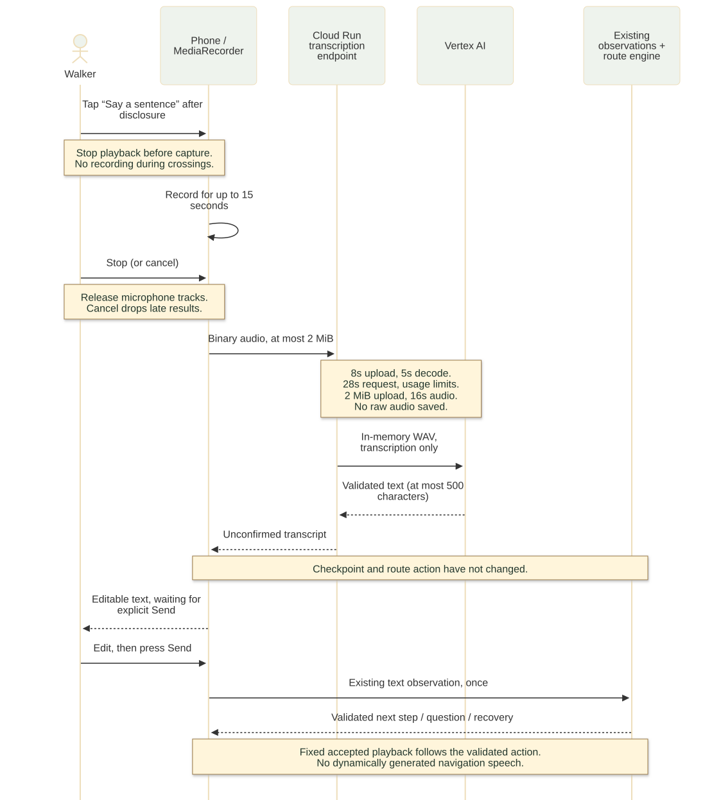

# Nightingale architecture — Chinese voice preview

These diagrams describe backend runtime `03bc45e7ce39b39ff2efda829a120f098f9acd6f` and frontend runtime `5d11a5006d0234443dd730503ab8e40d7a00eddb`, deployed as the limited `voice-input-20261008` preview. They describe implemented behavior, not full outdoor acceptance. The [deployment receipt](../deployment/2026-10-08-voice-preview/README.md) records the image and evidence limits.

## Route decisions


Editable [Mermaid source](nightingale-overview.mmd) · [SVG](nightingale-overview.svg) · [PNG for a deck](nightingale-overview.png)

The phone shows one validated step. Explicit text, prepared photos and walker confirmations reach `/api/sessions/:id/observations`. Gemini maps text/photo input to canonical route terms; it does not write the route graph or choose an arrival. Schema validation, deterministic keyword fallback for text, the validator and engine preserve the verified route rules. The session update is atomic, including the explicit confirmation of a pending recovery question.

The optional phone location is reduced to a zone ID before transmission. Photo guards can hold a step when location is missing or unknown; a zone alone never establishes arrival. Raw coordinates are not sent by this flow. The photo path resizes/re-encodes the image and removes metadata before upload. Raw images are not written by the application to Firestore or ordinary application logs; the provider's own retention is a separate matter.

Firestore stores route session state, the last action, an optional pending continuation with bounded canonical evidence, numeric photo/audio counters and expiry metadata. Unconfirmed transcripts and raw audio are not session fields. The existing photo/text observations endpoint and route fixture are the source of navigation behavior.

The phone validates the server response before presenting bounded text or a bird cue. Playback selects only the 44 accepted Chinese WAVs using route/checkpoint/action identities. Missing or ambiguous audio remains silent. It does not generate speech from server prose. While a crossing awaits the walker's confirmation, the input controls are absent and no recording runs; the existing fixed crossing instruction is followed by quiet waiting.

## Voice input and the confirmation boundary



Editable [Mermaid source](voice-input-sequence.mmd) · [SVG](voice-input-sequence.svg) · [PNG for a deck](voice-input-sequence.png)

`VoiceCapture` starts only after a press. `MediaRecorder.isTypeSupported()` negotiates WebM/Opus or MP4; a missing/denied capability leaves typing available. The maximum recording is 15 seconds. Stop releases tracks before transcription. Cancel, help, background, page hide, unmount or a changed action invalidates the generation token, releases tracks/timers and aborts the request; late permission grants are stopped.

`POST /api/sessions/:id/transcriptions` is separate from observations. The backend checks the session is eligible, reads at most 2 MiB under an 8-second upload deadline, checks the actual container signature, and uses FFmpeg through memory pipes to decode mono 16 kHz audio. Decode is bounded to 5 seconds and at most 16 seconds of audio, allowing limited recorder/codec padding beyond the frontend's 15-second cap. External input protocols, shell commands built from user data and temporary audio files are not used.

The Vertex transcription call receives normalized WAV and a transcription instruction, with no route context or geographic evidence. It returns a strict single-field JSON transcript capped at 500 characters. Empty/invalid output, provider 429, cancellation and timeout produce recoverable text notices. The whole endpoint has a 28-second deadline, including store waits; a delayed store result cannot start new model work after that deadline. An already-started Firestore quota transaction may still finish, but it contains only numeric usage metadata and cannot move the route.

The editable draft is the only successful frontend destination. The walker may change it; only pressing the existing Send button calls observations. Transcription never calls the route engine. A failed recording preserves an existing typed draft.

Cost controls: 12 audio transcriptions per session, 6 requests per client/minute, 10 per instance/minute and one active transcription pipeline per instance. Instance windows reset with process restart and are not a project-wide absolute spend ceiling. The limited revision is configured with min 0/max 1 and receives 0% production traffic.

## Evidence and source map

- Backend implementation: `src/audioUpload.ts`, `src/audio.ts`, `src/transcription.ts`, `src/transcriptionRoutes.ts`, `src/server.ts`, `src/store.ts`.
- Frontend implementation: `src/remote/voiceCapture.ts`, `voiceInputClient.ts`, `VoiceInput.tsx`, `Last300mPage.tsx`, `useLast300m.ts` in [the frontend repo](https://github.com/Crystal32378/Nightingale).
- [Independent code review](../acceptance/2026-10-08-voice-input/independent-review.md): reviewed implementation and the stalled-upload correction.
- [Hosted synthetic-voice evidence](../deployment/2026-10-08-voice-preview/hosted-voice.json): real desktop MediaRecorder, actual tagged API/Vertex/Firestore, with a fixed synthetic sample replacing the microphone.
- iPhone LINE actual microphone flow: [Crystal reports recording, editing and sending all succeeded](../acceptance/2026-10-08-voice-input/iphone-receipt.json). This is a user-reported phone acceptance for that flow, separate from desktop synthetic/hosted checks and full outdoor navigation.
- Full outdoor navigation and production release: HOLD. English UI/recordings and final demo/deck are subsequent stages.

## Re-render

[Mermaid CLI](https://github.com/mermaid-js/mermaid-cli) version 12.0.0 generated the SVG/PNG files. Example with a locally available Chrome path in `puppeteer.json`:

```bash
PUPPETEER_SKIP_DOWNLOAD=1 npx --yes @mermaid-js/mermaid-cli@12.0.0 \
  -i docs/architecture/nightingale-overview.mmd \
  -o docs/architecture/nightingale-overview.svg \
  -p puppeteer.json --size 1800 -b '#ffffff'
```

Change the input to `voice-input-sequence.mmd` for the second diagram; use `.png` output and `--size 2400` for deck images. No cloud service is called during rendering.
